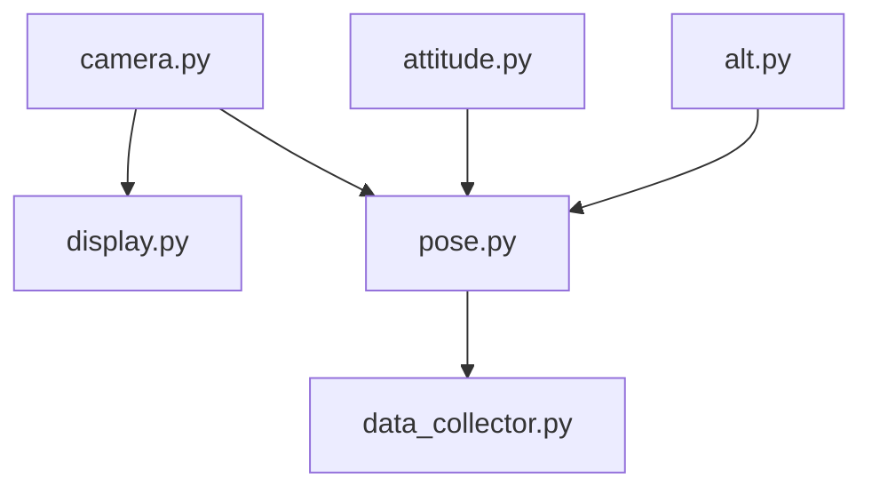
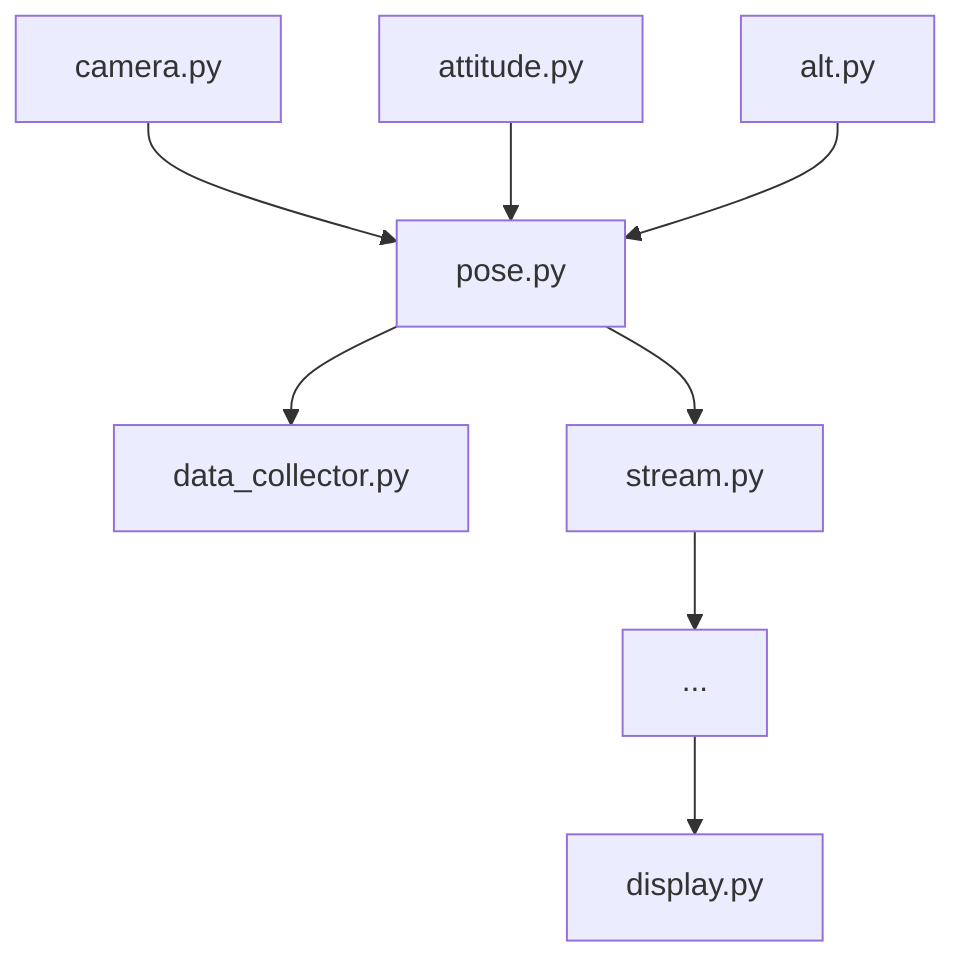

---

Глоссарій: 
- **паблішер** -- програма/клас/функція з ZMQ, яка використовує PUB сокет 
- **підписник/клієнт** -- програма/клас/функція з ZMQ, яка використовує SUB сокет 
- **сервіс** -- окремо запущена програма на Python
- **польотник** -- польотний контролер на базі Ardupilot
- **ендпоінт** -- назва хоста, яку використовує конкретний сокет, наприклад `ipc://@attitude.socket`. Зверніть увагу, що `ipc` сокети доступні тільки на лінуксі. 
- **IMU** (Intertial Measurment Unit) -- пара акселерометр-гіроскоп, яка видає положення (attitude) дрона


Завантажте архів `02-dataset_gps.zip` з лабораторної 2. 

## Task 0. Publishers (1б)

Створіть **паблішера** `sensors/imu.py` на ендпоінті `ipc://@attitude.socket`, який емулює роботу IMU сенсора:
- читає csv файл з даними польотника `data.csv` і надсилає у форматі `socket.send_pyobj({'ts': time.perf_counter(), 'roll': roll, 'pitch': pitch, 'yaw': yaw})` 
- дані мають надсилатись з частотою 50Hz, використовуйте `time.sleep`
- використовуйте `time.perf_counter` замість того `ts`, що вказаний в файлі

Створіть також іншого **паблішера** `sensors/camera.py` на ендпоінті `ipc://@images.socket`, який емулює роботу камери: 
- зчитує зображення з папки `img/` і надсилає їх у форматі `socket.send_pyobj({'ts': time.perf_counter(), 'img': img})` з частотою 15Hz.

- щоб зчитувати зображення використовуйте `cv2.imread`: 
```bash
$ pip install opencv-python 
$ python 
>>> import cv2 as cv 
>>> im = cv.imread('img/0001.png')
>>> im.shape
(800, 600)
```

- щоб отримати список зображень використовуйте вбудовану бібліотеку `glob`: 
```python

import glob 
import cv2 as cv

imgs = glob.glob('img/*.png')
imgs = sorted(imgs)    # glob повертає назви в хаотичному порядку

im = cv.imread(imgs[10])
```

## Task 1. Blocking sub-pub (1б)

Створіть **підписника** `services/display.py` на `ipc://@images.socket`, який чекає кожного наступного кадра і виводить його на екран, використовуючи `cv2.imshow`: 
```python 
import cv2 as cv

cv.imshow(im)     # показати зображення 
cv.waitKey(1)     # вікно з зображенням чекає, поки його закриють
```

Ті, хто працює з сервером AWS, просто виводьте розміри зображення `im.shape` і час.

## Task 2. Non-blocking sub-pub (1б)

Створіть **підписника** `services/att.py` на `ipc://@attitude.socket`, який працює в фоні і оновлює дані IMU, як тільки приходять нові. В головному циклі програма кожні 0.5с виводить статус і показує нинішнє положення. 

Використовуйте бібліотеку `threading`, як показано в матеріалах до практики 2. 


## Task 3. All together (1б)

Створіть третього **паблішера** `sensors/alt.py` на ендпоінті `ipc://@height.socket`, який зчитує висоту з `ground_truth.csv` і надсилає її у форматі `socket.send_pyobj({'ts': time.perf_counter(), 'alt': alt})`. Дані надсилаються з частотою 5Hz. 


Створіть **сервіс** `pose.py`, який матиме свого **паблішера** на ендпоінті `ipc://@pose.socket` і підписників на інші три паблішери: 
- підписник на `ipc://@camera.socket` -- працює в основному циклі в blocking режимі, як в завданні 1
- підписник на `ipc://@attitude.socket` -- працює в фоні, як в завданні 2
- підписник на `ipc://@height.socket` -- працює в фоні, як в завданні 2 

Задача сервісу `services/pose.py` -- скомбінувати дані з трьох сенсорів і опублікувати їх на `ipc://@pose.socket` у форматі:
```python

socket.send_pyobject({
	"ts": ts,
	"img": img, 
	"pose": {"roll": roll, "pitch": pitch, "yaw": yaw}, 
	"alt": alt,
})

```

Створіть ще сервіс `services/data_collector.py`, який підписаний на `ipc://@pose.socket` і зберігає дані положення і висоти в файл `dataset.csv`. 

В підсумку має получитись така архітектура: 



Запустіть це все в різних терміналах і запишіть екран з демо. 

## Task 4 (для допитливих)

Створіть баш скрипт `run_all.sh`, який запускає всі 5 сервісів і працює доки користувач не перерве роботу програми
через CTRL+C. Скрипт обовʼязково має вбивати в кінці всі сервіси, які запустив. Спробуйте знайти на просторах інтернету як це зробити (**тільки не вбивайте буласка взагалі всі python процеси**, в лінуксі пів системи на пайтоні працює)

Створіть `services/stream.py` так, щоб він брав дані з `ipc://@pose.socket` і: 
- заміряв частоту, з якою приходять дані. Для цього він рахує дельту між таймстемпами сусідніх даних, зберігає останні 11 і рахує від них середнє. Таким чином отримує середню дельту між фреймами. Середній FPS буде 1 / дельта. 
- виводить частоту і положення на зображення, використовуючи `cv.putText`. Поекспериментуйте з розміром тексту 
- публікує результуюче положення на ендпоінт `tcp://*:5588`

Якщо ви робили все на AWS сервері, то тепер ви зможете запустити `services/display.py` на онлайн ендпоінт `tcp://<ip сервера>:5588` і виводити його на екран. WSL або локальний лінукс може це виводити з `tcp://localhost:5588`. 

В підсумку має вийти отака архітектура:


Подивитись ip вашого сервера можна в налаштуваннях AWS. 

Щоб цей фокус пройшов, потрібно також відкрити порт 5588 в Security Group вашого сервера. Краще відкривайте його тільки для себе. Глянути свій IP можна через сайт https://who.is.
