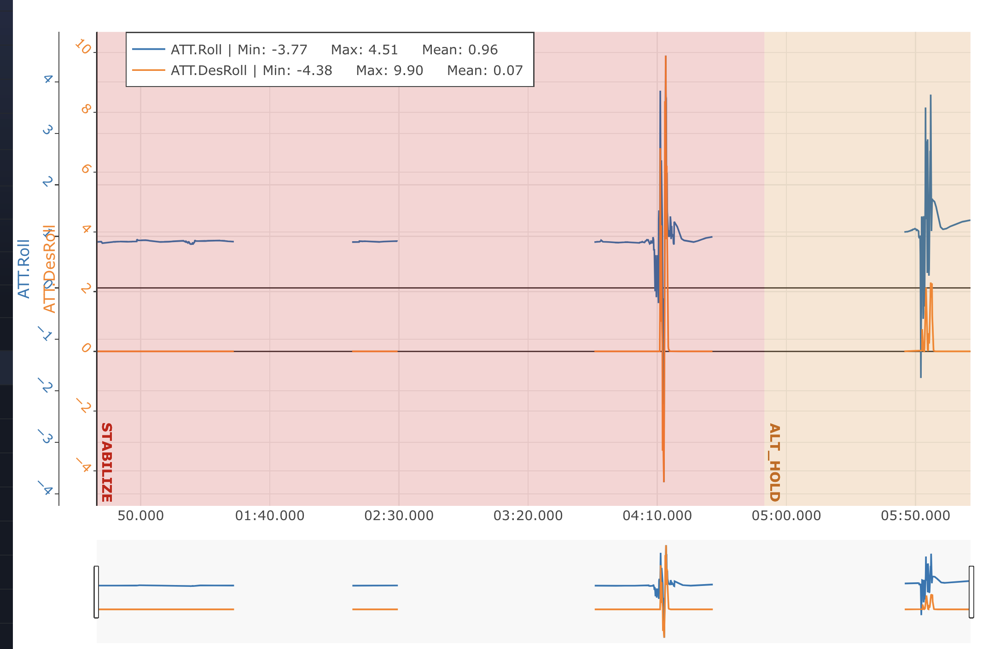

created: 2025-09-11  10:25
Tags: [[visual navigation]] [[materials]]

---

Рекомендовані ресурси: 
- https://mavlink.io/en/
- https://mavlink.io/en/mavgen_python/
- онлайн тулза для аналізу логів: https://plot.ardupilot.org/#/
- дока з ардупайлота по аналізу логів: https://ardupilot.org/copter/docs/common-downloading-and-analyzing-data-logs-in-mission-planner.html
- відос 12-річної давнини по аналіу логів: https://www.youtube.com/watch?v=62TmGiwFiDU&t=6s
- MAVExplorer: https://ardupilot.org/dev/docs/using-mavexplorer-for-log-analysis.html
- дока з ардупайлота по вібраціях: https://ardupilot.org/copter/docs/common-measuring-vibration.html


---

Найпростіше аналізувати логи через https://plot.ardupilot.org/#/ або напряму працювати з csv файлами.


## Приклад 

Розглянемо `00-practice2_stab_althold.bin` лог польоту, який ми робили на тестовому дроні в аудиторії. 

у нас нічого не вивело одразу, оскільки не було жодного джерела глобального положення (GPS, одометрія)


якби ж ми взяли лог з GPS координатами, то було б щось типу такого 


типу сайт одразу намагається намалювати на інтерактивній карті нашу траекторію. 

нас цікавить розділ `Plot Individual Fields`, де зібрані всі типи мавлінк повідомлень, які ми можемо намалювати


розшифровка всіх цих назв інформативна в Mission Planner logs analysis, або
можна ще почитати в
https://ardupilot.org/copter/docs/logmessages.html#logmessages. В гіршому
випадку доводиться йти в сорс код ардупайлота і шукати там
https://github.com/ArduPilot/ardupilot.

З найпростіших речей, які ми можемо одразу глянути, є наприклад вібрації по x, y і z:

зверху кнопочка Events виведе ще події, які траплялись:


можем звідси зрозуміти (багато подій `armed`), що в цьому лозі було кілька польотів. Перший раз ми намагались
в STABILIZE перевірити чи коптер правильно слухає керування. Потім був один політ в ALT_HOLD. Окрім цього я ще кілька
разів тикав арм-дізарм, щоб перевірити чи правильно крутяться мотори. 

можем одночасно вивести всі вібрації під час польоту в альтхолді

зауважте, що сайтік сам автоматично рахує з яким скейлом виводити графік і
часто робить це неправильно. Звертайте увагу на осі зліва, їх треба ручками
вирівнювати (кольосіком масштаб, перетягуванням біас)

тепер норм


бачим великий пік по Z якраз тоді, коли дрон сів. Таке буває, це +- норм історія. 

можем глянути ще наприклад розділ ATT: 

бачимо, що є пробіли в даних. Це повʼязано з тим, що дрон був задізармлений
(себто з вимкненими моторами)

задача логів польотника -- зібрати всю інфу чого ваш дрон упав. Тому нема сенсу
активно логувати, коли він стоїть на землі. Збільшим альтхолд частину, коли хоч
щось відбувалось 


`ATT.DesRoll` (Desired Roll) -- це значення рола, яке є цільовим для
польотника. Себто це те значення, яке або виставив юзер, або потрібне для
тримання положення. `ATT.Roll` -- це оціночний рол в нинішньому моменті. Як
бачимо, вони ніфіга не близько друг біля друга. В принципі, як і було під час
польоту, -- дрон штормило по ролу, він не тримав стабільно своє положення.

Це вказує на кілька потенційних проблем: 
- погано налаштовані піди
- поганий регулятор (ESC)
- погана калібрація

на погану калібрацію ще вказує оцей постійний біас, ніби рол в нас вічно один градус. Тому все може бути. 

Для дедальнішого аналізу нам треба б розділ `CTUN`, але його тут нема. Походу
випадково поганий параметр логування поставлений


## Pymavlink


Встановити `pymavlink` можна через `pip`: 

```bash
pip install pymavlink
```

тоді у вас зʼявиться такий сприптік

```bash
mavlogdump.py --help
```

В основному будем використовувати експорт в csv файл: 

```bash
mavlogdump.py --types=ATT --format=csv 01-wo-visp.bin > output.csv
```

Щоб подивитись всі можливі типи, які можна експортувати (використовуємо sort, щоб по алфавіту вивело): 
```bash
mavlogdump.py --show-types 01-wo-visp.bin | sort
```
