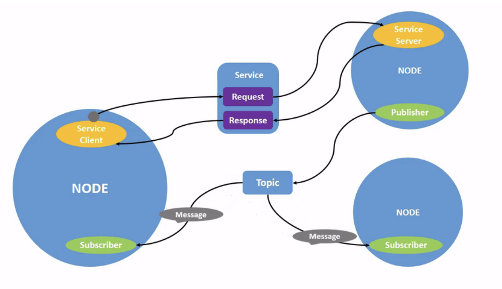
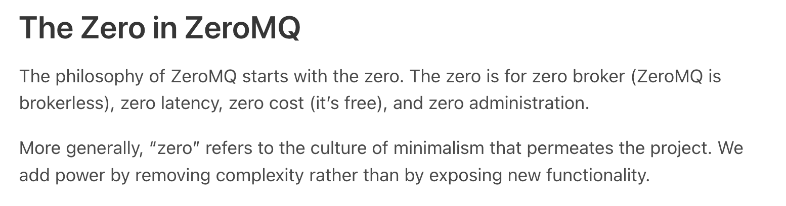
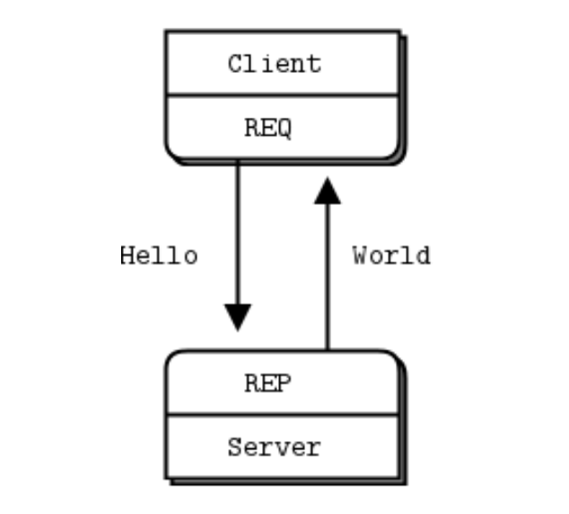
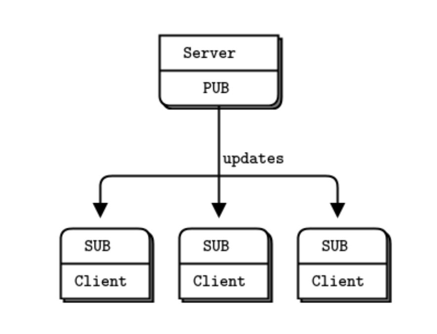
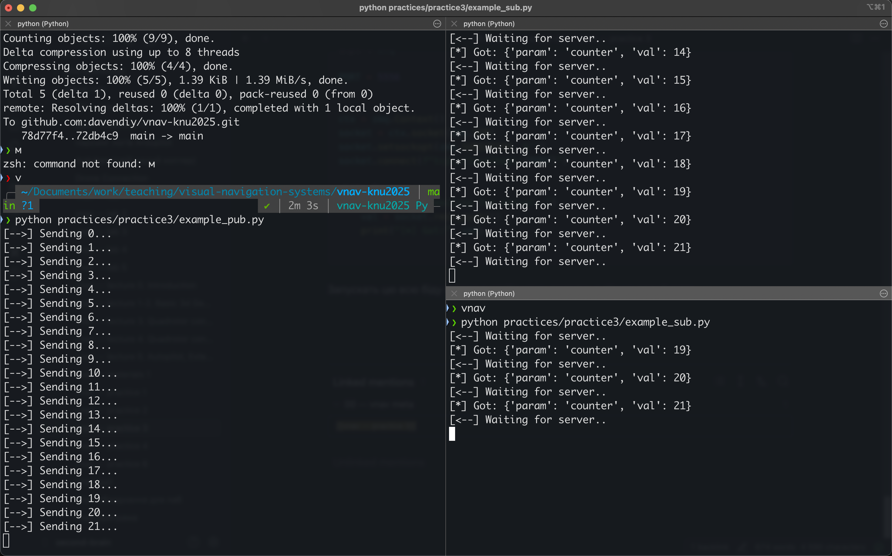
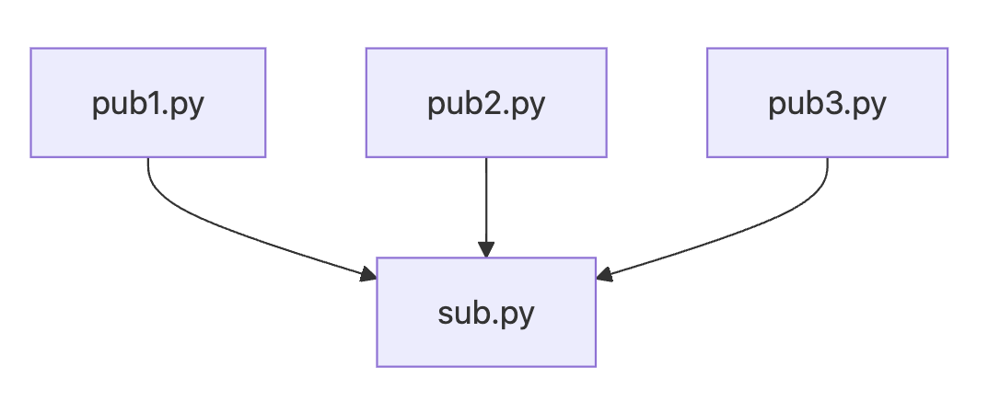
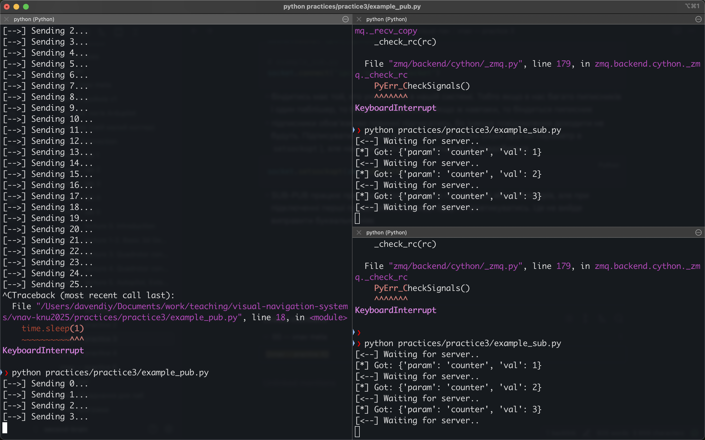

# Практичне заняття 3. Знайомство з ZeroMQ

Рекомендовані ресурси:
- https://zeromq.org/languages/python/
- https://zguide.zeromq.org/docs/chapter5/
- презентації Обвінцева по будові глобальних мереж і сокетах: https://github.com/krenevych/applied-programming/blob/main/%D0%A2%D0%B5%D0%BC%D0%B0f
- презентації Обвінцева по паралельним обчисленням: https://github.com/krenevych/applied-programming/blob/main/%D0%A2%D0%B5%D0%BC%D0%B0%204.%20%Df
- приклади паралельних обчислень Обвінцева: https://github.com/krenevych/applied-programming/tree/main/%D0%A2%D0%B5%D0%BC%D0%B0%204.%20%D0%9F%D0%F

---

ROS pub-sub model 


- Будем використовувати ZMQ, щоб це повторить
- є на всі мови
- можна пікльом надсилати
- проблеми з пікльом
- приклад з REQ-REP
- приклад з SUB-PUB
- особливості SUB-PUB сокетів
- приклад з використанням потоків в фоні


---

### Встановлення

Встановити треба через pip:
```bash
pip install pyzmq
```

https://zeromq.org/get-started/




## REQ-REP сокети

https://zguide.zeromq.org/docs/chapter1/



Далі типовий програма сервера ([example_server.py](./example_server.py)):

```python
import zmq

context = zmq.Context()
socket = context.socket(zmq.REP)
socket.bind("tcp://*:5555")

while True:
  p = socket.recv_pyobj()
  print(p)
  socket.send_pyobj("pong")
```


І типова програма клієнта ([example_client.py](./example_client.py)):

```python
import zmq

context = zmq.Context()
socket = context.socket(zmq.REQ)
socket.connect("tcp://localhost:5555")

while True:
  socket.send_pyobj("ping")
  print(socket.recv_pyobj())
```

Спершу ми створюєм контекст `zmq.Context()`. Всередині цього
контексту мусять бути всі сокети, які ви юзаєте. Якщо контекст
закриється, то всі сокети викинуть помилку. Тому треба використовувати
глобальний контекст менеджер (про це трохи далі).

Сокети мають різні типи, тут ми використали REQ-REP шаблон підключення.

```python
socket = context.socket(zmq.REP)
```

REQ-REP означає request-responce. Цей тип підключення
корисний тоді, коли треба визначити якийсь конкретний порядок
роботи кількох програм.

- REQ-REP використовуєм тільки парою клієнт-сервер (1 клієнт і 1 сервер)
- REQ-REP гарантує, що повідомлення дійдуть до отримувача
- REQ-REP вимагає, щоб клієнт і сервер спілкувались по черзі. Якщо ж
хтось з них надішле два повідомлення підряд, то вилетить помилка.
- в REQ-REP хтось один має забіндитись, а хтось інший приєднатись:
```python
# server.py
socket.bind("tcp://*5555")

# client.py
socket.connect("tcp://*5555")
```
- біндиться зазвичай сервер, а клієнт приєднується (насправді можна й навпаки)
- в даному випадку ми використали tcp порт 5555, хоча могли й будь-який інший.
Порт -- це просто якесь число, зазвичай не більш як 4-значне. Головне, щоб
ваш порт ніяка інша програма вже не використовувала, тому обирайте якесь рандомне.
- в лінуксі можна використати так звані `ipc` (Inter Process Communication) сокети --
спеціальні сокети, які придумали для спілкування різних програм друг з другом. Ми
будемо їх далі використовувати, приклад ([./pub_linux.py](./pub_linux.py)):
```python
socket.bind("ipc://@example.socket")
```
- кайф zmq в тому, що приєднуватись можна однаково як і з локальної машини
(тобто на тому самому компʼютері) через `localhost:5555`, так і десь з інтернету, якщо
відома ip-адреса. Приклад: нехай у нас є разбері, яка працює в тій самій
мережі, що й компʼютер з ip адресою `192.168.0.111`. Нехай на ній працює [example_server.py](./example_server.py),
який ми розглядали вище. Тоді з компʼютера можна приєднатись до неї через
```python
socket.connect("tcp://192.168.0.111:5555")
```

---

## PUB-SUB сокети

https://zguide.zeromq.org/docs/chapter5/



- будем використовувать в основному їх 

Глянем приклад паблішера з [example_pub.py](./example_pub.py):
```python
import zmq
import time

PORT = 5556


ctx = zmq.Context()

socket = ctx.socket(zmq.PUB)
socket.bind(f"tcp://*:{PORT}")

i = 0

while True:
    print(f"[-->] Sending {i}...")
    socket.send_pyobj({"param": "counter", "val": i})
    i += 1
    time.sleep(1)
```

і підписника: 

```python
import zmq

PORT = 5556


ctx = zmq.Context()
socket = ctx.socket(zmq.SUB)
socket.setsockopt(zmq.SUBSCRIBE, b'')
socket.connect(f"tcp://localhost:{PORT}")

while True:
    print("[<--] Waiting for server..")
    val = socket.recv_pyobj()
    print("[*] Got:", val)

```

Запускать цю всю біду можна в довільному порядку в різних терміналах.


в даному випадку паблішер в нас один, а підписників багато. Насправді нічо нам не мішає зробити і навпаки: паблішерів багато, а підписник один 



- аналогічно до REQ-REP в нас є ʼʼсерверʼʼ і ʼʼклієнтиʼʼ -- сервер біндиться, а клієнти конектяться. 
```python 

# example_pub.py
socket.bind('ipc://@example.socket')

# example_sub.py
socket.connect('ipc://@example.socket')
```
- біндитись має той, хто унікальний в нашій системі. Тобто якщо в нас багато пиписників і один паблішер, то біндиться паблішер. Якщо ж навпаки, то біндиться пиписник
- підписники обовʼязково повинні підписатись, бо інакше повідомлення доходити не будуть. Підписуватись можна взагалі на різні топіки (оцей другий параметр в `setsockopt`), але нам воно в більшості випадків не знадобиться  
```python
socket.setsockopt(zmq.SUBSCRIBE, b'')
```
- SUB-PUB працює пречудово коли є багато підписників або паблішерів, але при підключенні перші повідомлення завжди будуть провтикуватись. Це не вийде виправити буквально ніяк 

приклад: якщо першими запустити підписників, а далі паблішера, то всеодно перше повідомлення провтикується (Sending 0 було, а Got {param: counter, val: 0} не було): 




## Blocking vs non-blocking 

[pub_linux.py](./pub_linux.py)  і  [sub_linux.py](./sub_linux.py)


## Advanced

[base classes](../../common/conc_base.py)
